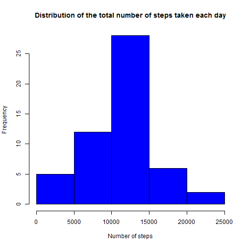
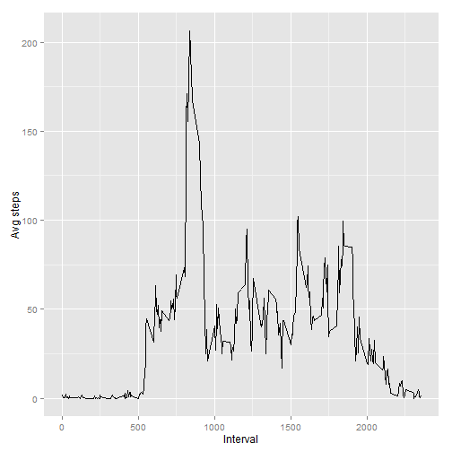
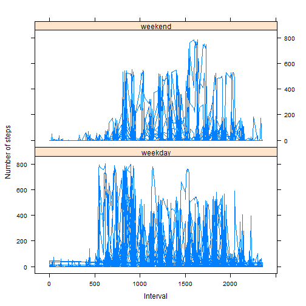

# Reproducible Research: Peer Assessment 1

First I initialze the root and settings some libraries

```r
root <- "C:/Users/albert.QBIDS/Coursera/Johns Hopkins/The Data Science Track/5 Reproducible Research/Project1/Github"
setwd(root)
library(ggplot2)
```

```
## Warning: package 'ggplot2' was built under R version 3.1.1
```

```r
library(plyr)
```

## Loading and preprocessing the data


Unzip the archive

```r
localarchive <- "activity.zip"
tempdir <- root
unzip(localarchive, exdir=tempdir)
file = "activity.csv" #the name of the file in the archive
data <- read.csv(file , header=T)
```

Preprocessing data. We make a true date column

```r
data$date <- as.Date(data$date, format = "%Y-%m-%d")
```


## What is mean total number of steps taken per day?
For this part of the assignment, I ignore the missing values in the dataset.

First I calculate the numbers of steps for each day, removing NA's

```r
stepscount <- aggregate(steps ~ date, data, FUN=sum, na.rm=T)
```

The purpose of the histogram is to give an idea of distribution is of the values of the total number of steps that are taken each day.

```r
hist(stepscount$steps,col="blue",xlab="Number of steps", main="Distribution of the total number of steps taken each day")
```

 

*calculate the mean*

```r
mean(stepscount$steps)
```

```
## [1] 10766
```

*calculate the median*

```r
median(stepscount$steps)
```

```
## [1] 10765
```

## What is the average daily activity pattern?

1. Make a time series plot (i.e. type = "l") of the 5-minute interval (x-axis) and the average number of steps taken, averaged across all days (y-axis)

```r
meanofstepsperinterval <- aggregate(steps ~ interval, data, FUN=mean, na.rm=T)
ggplot(meanofstepsperinterval, aes(interval, steps)) + geom_line() + xlab("Interval") + ylab("Avg steps")
```

 

2. Which 5-minute interval, on average across all the days in the dataset, contains the maximum number of steps?

```r
maxmeanofstepsperinterval <- aggregate(steps ~ interval, meanofstepsperinterval, FUN=max, na.rm=T)
```

Return the row with the highest average number of steps

```r
maxmeanofstepsperinterval[maxmeanofstepsperinterval$steps == max(maxmeanofstepsperinterval$steps),]
```

```
##     interval steps
## 104      835 206.2
```

## Imputing missing values

*1. Calculate and report the total number of missing values in the dataset (i.e. the total number of rows with NAs)*

```r
numberofmissingvalues <- sum(is.na(data$steps))
```

*2. Devise a strategy for filling in all of the missing values in the dataset.*

My strategy:

- Generates average values for each time period
- Merge them back into the data into a new variable (so that each entry has the average available)
- Replace the NAs with the average

*3. Create a new dataset that is equal to the original dataset but with the missing data filled in.*
- Create a new dataset


```r
data.imputed <- data
```

- Generates average values for each time period


```r
data.imputed.meanofstepsperinterval <- aggregate(steps ~ interval, data.imputed, FUN=mean, na.rm=T)
```

- Merge them back into the data into a new variable (so that each entry has the average available)


```r
data.imputed$interval_mean <- data.imputed.meanofstepsperinterval[data.imputed.meanofstepsperinterval$interval == data.imputed$interval, 2]
```

- Replace the NAs with the average data$thingtoreplace[is.na(data$thingtoreplace)] <- data$newthing


```r
data.imputed$steps[is.na(data.imputed$steps)] <- data.imputed$interval_mean
```

```
## Warning: number of items to replace is not a multiple of replacement
## length
```


*4. Make a histogram of the total number of steps taken each day...*

```r
stepscount.imputed <- aggregate(steps ~ date, data.imputed, FUN=sum, na.rm=T)

hist(stepscount.imputed$steps,col="blue",xlab="Number of steps", main="Distribution of the total number of steps taken each day")
```

 

*...and Calculate and report the mean and median total number of steps taken per day.*

**calculate the mean**


```r
mean(stepscount.imputed$steps)
```

```
## [1] 10766
```

**calculate the median**


```r
median(stepscount.imputed$steps)
```

```
## [1] 10766
```

*Do these values differ from the estimates from the first part of the assignment?*
Only the median is different.

*What is the impact of imputing missing data on the estimates of the total daily number of steps?*
The impact is very small.


## Are there differences in activity patterns between weekdays and weekends?
*1. Create a new factor variable in the dataset with two levels - "weekday" and "weekend" indicating whether a given date is a weekday or weekend day.*


```r
data.imputed$kindofday <- as.factor( ifelse(weekdays(data.imputed$date) %in% c('Saturday','Sunday'), 'weekend', 'weekday') )
```


*2. Make a panel plot containing a time series plot (i.e. type = "l") of the 5-minute interval (x-axis) and the average number of steps taken, averaged across all weekday days or weekend days (y-axis).*

```r
library(lattice)

xyplot(steps~interval|kindofday,type="l",data=data.imputed,layout=c(1,2),xlab="Interval",ylab="Number of steps")
```

 
