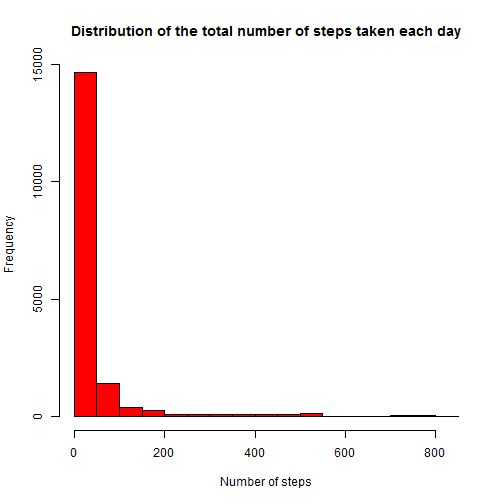

# Reproducible Research: Peer Assessment 1

First I initialze the root and settings some libraries

```r
root <- "C:/Users/albert.QBIDS/Coursera/Johns Hopkins/The Data Science Track/5 Reproducible Research/Project1/Github"
setwd(root)
library(ggplot2)
```

```
## Warning: package 'ggplot2' was built under R version 3.1.1
```

```r
library(plyr)
```

## Loading and preprocessing the data


Unzip the archive

```r
localarchive <- "activity.zip"
tempdir <- root
unzip(localarchive, exdir=tempdir)
file = "activity.csv" #the name of the file in the archive
data <- read.csv(file , header=T)
```

Preprocessing data. We make a true date column

```r
data$date <- as.Date(data$date, format = "%Y-%m-%d")
```


## What is mean total number of steps taken per day?
For this part of the assignment, I ignore the missing values in the dataset.

First I calculate the numbers of steps for each day, removing NA's

```r
stepscount <- aggregate(steps ~ date, data, FUN=sum, na.rm=T)
```

The purpose of the histogram is to give an idea of distribution is of the values of the total number of steps that are taken each day.

```r
hist(stepscount$steps,col="blue",xlab="Number of steps", main="Distribution of the total number of steps taken each day")
```

 

*calculate the mean*

```r
mean(stepscount$steps)
```

```
## [1] 10766
```

*calculate the median*

```r
median(stepscount$steps)
```

```
## [1] 10765
```

## What is the average daily activity pattern?

1.Make a time series plot (i.e. type = "l") of the 5-minute interval (x-axis) and the average number of steps taken, averaged across all days (y-axis)

```r
meanperinterval <- aggregate(steps ~ interval, data, FUN=mean, na.rm=T)
ggplot(meanperinterval, aes(interval, steps)) + geom_line() + xlab("Interval") + ylab("Avg steps")
```

 

2.Which 5-minute interval, on average across all the days in the dataset, contains the maximum number of steps?

```r
maxmeanperinterval <- aggregate(steps ~ interval, meanperinterval, FUN=max, na.rm=T)
```

Return the row with the highest average number of steps

```r
maxmeanperinterval[maxmeanperinterval$steps == max(maxmeanperinterval$steps),]
```

```
##     interval steps
## 104      835 206.2
```

## Imputing missing values

*1.Calculate and report the total number of missing values in the dataset (i.e. the total number of rows with NAs)*

```r
numberofmissingvalues <- sum(is.na(data$steps))
```

*2. Devise a strategy for filling in all of the missing values in the dataset.*

My strategy:

- Generates average values for each time period

```r
meanperinterval <- aggregate(steps ~ interval, data, FUN=mean, na.rm=T)
```

- Merge them back into the data into a new variable (so that each entry has the average available)
- Replace the NAs with the average data$thingtoreplace[is.na(data$thingtoreplace)] <- data$newthing

When I was working I used the following code: 
**data$interval_mean <- meanperinterval[data$interval, 2]**
however, this is causing me an error which I could not solve quickly. 


*3.Create a new dataset that is equal to the original dataset but with the missing data filled in.*
I used the example described at http://stackoverflow.com/a/9322975/3657371

```r
impute.mean <- function(x) replace(x, is.na(x), mean(x, na.rm = TRUE))
```

Create a new dataset that is equal to the original dataset, but with the missing data filled in original dataset is first three variables of the [activity] dataframe

```r
data.imputed <- plyr::ddply(data[1:3], .(interval), transform,
                                steps = impute.mean(steps),
                                date = date,
                                interval = interval)
```

Sort by date and interval


```r
data.imputed <- data.imputed[order(data.imputed$date,
                                   data.imputed$interval),]
```

Renumber rownames

```r
row.names(data.imputed) <- 1:nrow(data.imputed)
```

*4.Make a histogram of the total number of steps taken each day...*

```r
hist(data.imputed$steps,col="red",xlab="Number of steps", main="Distribution of the total number of steps taken each day")
```

 

and Calculate and report the mean and median total number of steps taken per day. 
**calculate the mean**

```r
mean(data.imputed$steps)
```

```
## [1] 37.38
```

**calculate the median**

```r
median(data.imputed$steps)
```

```
## [1] 0
```

*Do these values differ from the estimates from the first part of the assignment?*
Yes, they do. However, I get a complete different result for the number of steps so there must be something wrong with the code.

*What is the impact of imputing missing data on the estimates of the total daily number of steps?*
I cannot answer this question.


## Are there differences in activity patterns between weekdays and weekends?
